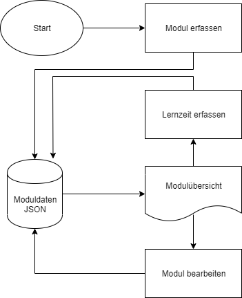

# PROG2 - Projektidee Daria Gloor
# Lernufwandrechner für das Studium

## Ausgangslage
Anfangs Semester wird vorgegeben, welche Module absolviert werden und wie diese gewichtet sind. Nun stellt sich aber immer die Frage, wie viel Zeit man in ein Modul stecken soll?

Hier kann der Lernaufwandrechner helfen! 

Er soll Auskunft darüber geben wie viel Aufwand pro Modul ansteht und wie viel Aufwand nach Abzug der Lernaktivitäten noch verbleibt. Somit soll eine bessere Lernplanung während dem Semester gewährleistet werden, damit man bei der Lernphase am Ende des Semesters nicht in den Stress kommt --> zumindest nicht aufgrund der Unwissenheit bezüglich des nötigen Lernaufwands ;)

## Funktion/Projektidee:
Die Applikation ist dafür gedacht Studenten bei der Einteilung ihrer Lernzeit zu unterstützen. Am Anfang vom Semester sollen die Module und die entsprechenden Credits eingegeben werden und auf der Übersicht angezeigt werden wie hoch die empfohlene Lernzeit, aufgrund der Eingabe, für jedes Modul ist. Während dem Semester sollen Lerneinträge wie Vorlesungen, Zusammenfassungen, Nachbearbeitung usw. erfasst werden. Die verbliebene Lernzeit soll in der Übersicht jederzeit angezeigt werden, was dazu helfen kann eine bessere Lernplanung vorzunehmen. Am Ende des Semesters bestetht die Möglichkeit die Modulnote einzutragen und so ein persönliches Fazit zu ziehen. 
 
## Workflow

### Ablaufdiagramm
Zu Beginn der Projektentwicklung wurde das Ablaubdiagramm erstellt

### Wireframe
Es wurden Wireframes entwickelt um das Design der HTML-Seiten der Webapplikation ungefähr zu bestimmen.

### Dateneingabe
Um ein neues Modul zu erfassen navigiert der User wia Startseite oder Navigation auf die Seite modulerfassen.html und füllt die Pflichtfelder Semester, Modulname und Credits im Formular aus. Während des Semesters kann der User die Lernzeiten via Modulübersicht auf der Seite lernzeitdetail.html mit Datum, Lernzeit und optional einem Kommentar in einem Formular erfassen. Es besteht auch die Möglichkeit die eingegebenen Moduldaten via Modulübersicht zu bearbeiten. Am Schluss des Semesters, nach Bekanntgabe der Noten, kann diese Information via Modulübersicht auf der Seite modulbearbeiten.html ebenfalls in einem Formular eingegeben werden.

### Datenverarbeitung/Speicherung
Alle Daten werden in der Datei data.json in einem Dictionary gespeichert. Der Modulname dient als Key und alle Informationen zum Modul und alle Lernzeiteneinträge werden dort gespeichert. Die Gesamtlernzeit und die verbliebene Lernzeit wird aufgrund der Eingaben des Users berechnet. Will man die Moduleingaben verändern, ist dies über die Seite modulbearbeiten.html ebenfalls möglich. 

### Datenausgabe
Die eingegebenen Formulardaten von der Erfassung der Module, Lernzeiten und Modulnoten können in der Modulübersicht eingesehen werden. Die Auflistung der Lernzeiten wird separat auf lernzeitdetail.html ausgegeben. Die Berechnungen zum Gesamtlernaufwand und zum verbliebenen Lernaufwand sind ebenfalls in der Modulübersicht zu finden. 

### Feinheiten
- Die Eingabe an Lernaufwand darf 24h nicht überschreiten.
- Es gibt keine höhere Note als eine 6.
- Texteingabefelder haben eine begrenzte Anzahl Zeichen.
- Einzele Felder sind Pflicht und ohne eine entsprechende Eingabe läuft das Programm nicht weiter. 

## Benutzeranleitung

### Ein neues Modul erfassen 
1. Man startet auf der Startseite und hat die Möglichkeit ein Modul zu erfassen oder in die Modulübersicht zu wechseln
- Wenn noch keine Module erfasst sind, ist die Übersicht leer 

	
2. Um ein neues Modul zu erfassen auf den Button "Ein neues Modul erfassen" klicken 

3. Eingaben entsprechend vornehmen:
- Semester wia Dropdown auswählen
- Modulnamen eingeben
- Anzahl Credits via Dropdown auswählen

4. Mit dem Button "Bestätigen" wird das Modul erfasst
	
5. Um die Einträge zu sehen nun via Button "Zur Modulübersicht" auf die Modulübersicht navigieren

6. Hier sind die eingegebenen Modulinformationen einsehbar und zusätzlich wurde der Gesamtlernaufwand in der Spalte "Aufwand insgesamt (min)" berechnet

### Lerneinträge erfassen 
1. Modulübersicht wia Startseite oder Navigation öffnen

2. In der Spalte Lernaufwand auf die blau hervorgehobene Zahl klicken
- Ist noch kein Aufwand erfasst, auf die blau hervorgehobene Null klicken

	
3. Nun kann der Lernaufwand erfasst werden mit den Eingaben:
- Datum
- Lernzeit (in Minuten)
- Optional einen Kommentar erfassen

	
4. Der erfasste Eintrag wird der Liste unterhalb hinzugefügt

5. Navigiert man zurück auf die Modulübersicht, ist die erfasste Lernzeit ersichtlich und es wird angezeigt, wie viel Lernaufwand noch übrig bleibt
- Nach jeder weiteren Erfassung der Lernzeit werden sich diese beiden Zahlen entsprechend verändern

### Änderungen der Modulinformationen
1. Modulübersicht wia Startseite oder Navigation öffnen

2. In der Spalte Modulname auf den blau hervorgehobenen Modulnamen klicken

3. Hier hat man die Möglichkeit Änderungen zu den eingegebenen Modulinformationen vorzunehmen:
- Semester
- Modulname
- Credits

	
4. Für die erfolgreiche Änderung auf den Button "Bestätigen" klicken

5. Direkte Weiterleitung an die Modulübersicht 

### Modulnote erfassen
1. Modulübersicht wia Startseite oder Navigation öffnen

2. In der Spalte Modulnote auf das blau hervorgehobene Wort "erfassen" klicken 

3. Modulnote im entsprechenden Feld eintragen und auf den Button "Bestätigen" klicken

4. Direkte Weiterleitung an die Modulübersicht 

